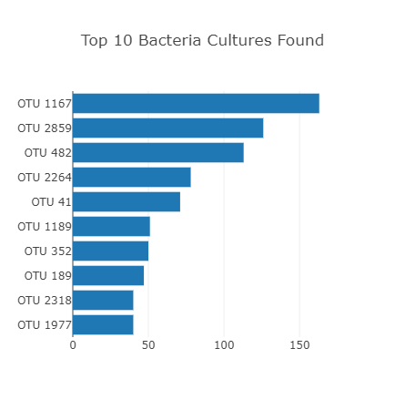
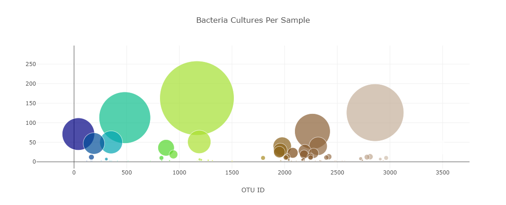
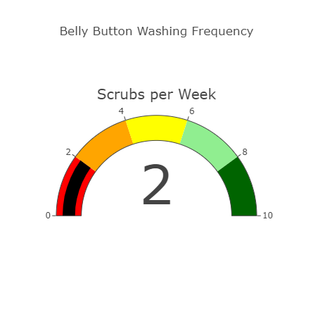
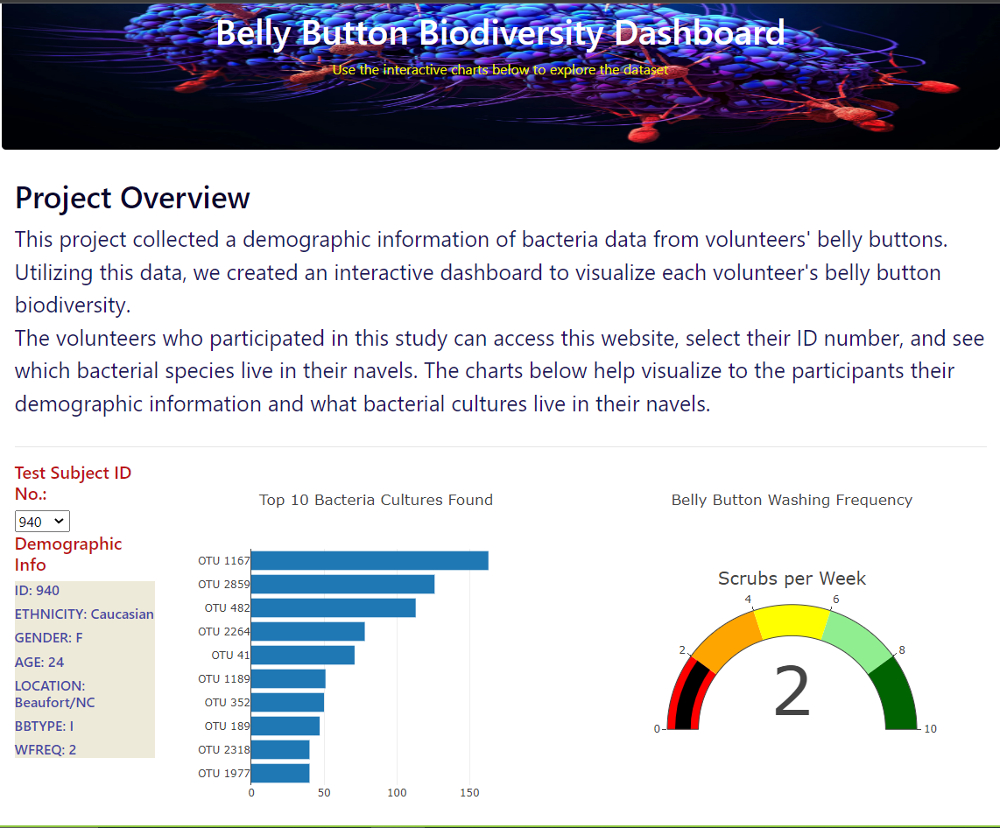

# Belly-Button-Biodiversity

## Project Overview:

### This project collected a demographic information of bacteria data from volunteers' belly buttons.
### Utilizing the data given in the samples.json file, we created an interactive dashboard to visualize each volunteer's belly button biodiversity.

## Project Results:

### The Horizontal Bar Chart displays each subject's top ten bacterial species in their navels.

### The Bubble Chart displays bacteria culture test result for each sample.

### The Gauge Chart displays the count for each candidate's belly button wash, per week.

### Please visit the link below to access the interactive dashboard created to help Roza.
https://abidor13.github.io/Belly-Button-Biodiversity/

## Project Summary:

### The volunteers who participated in this study can access this website, select their ID number, and see which bacterial species live in their navels. The charts below help visualize to the participants their demographic information and what bacterial cultures live in their navels.